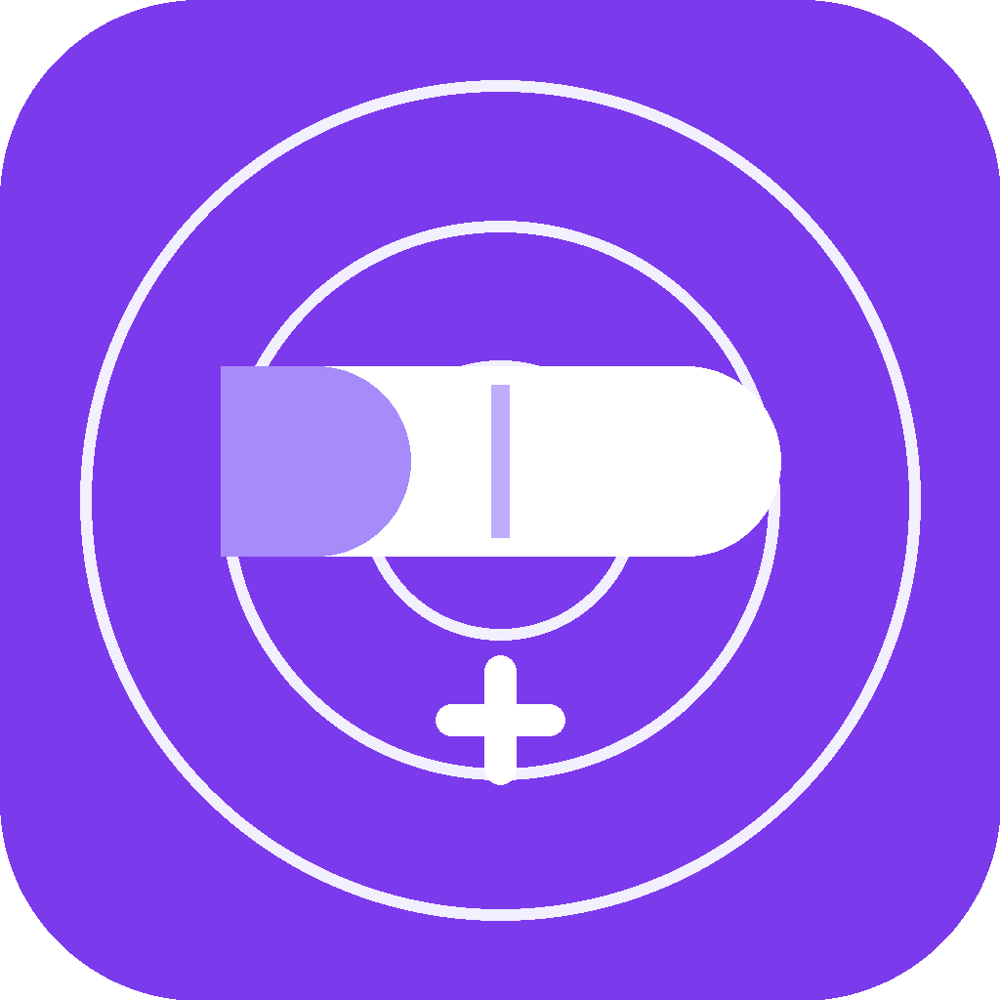

<div align="center">



# MediMind 💊

**Your personal medication reminder assistant**

_Never miss a dose again — works offline, syncs everywhere_

[](https://expo.dev)
[](https://reactnative.dev)
[](https://firebase.google.com)
[](https://typescriptlang.org)
[](LICENSE)

</div>

---

## ✨ Features

| Feature | Description |
|---|---|
| 🔔 **Smart Reminders** | Reliable daily, weekly, weekday or custom-day notifications |
| 📅 **Weekly Scheduling** | Set medicines like Vitamin D3 every Monday |
| 📶 **Offline-First** | Full functionality without internet via Zustand + AsyncStorage |
| ☁️ **Cloud Sync** | Auto-syncs to Firestore when connected |
| 📊 **History View** | Monthly calendar showing perfect / partial / missed days |
| 🎨 **Clean Design** | Black, white & purple UI — high contrast & accessible |
| 🔐 **Secure Auth** | Google Sign-In or Email/Password with persisted session |

---

## 📱 Screenshots

> _Add screenshots here after running the app_

| Home | Add Medicine | History |
|------|-------------|---------|
| Today's schedule with progress | Frequency: Daily, Weekly, Custom | Monthly adherence calendar |

---

## 🛠 Tech Stack

- **Framework** — [Expo](https://expo.dev) (SDK 52) with [Expo Router](https://expo.github.io/router) file-based navigation
- **UI** — [React Native Paper](https://reactnativepaper.com) + custom design system (black / white / purple palette)
- **State** — [Zustand](https://zustand-demo.pmnd.rs) persisted to [AsyncStorage](https://github.com/react-native-async-storage/async-storage)
- **Backend** — [Firebase](https://firebase.google.com): Firestore (sync) + Auth (Google & Email)
- **Notifications** — [expo-notifications](https://docs.expo.dev/versions/latest/sdk/notifications/) with daily / weekly OS-level scheduling
- **Date utilities** — [date-fns](https://date-fns.org)

---

## 🚀 Getting Started

### Prerequisites

- Node.js ≥ 18
- [Expo CLI](https://docs.expo.dev/get-started/installation/) — `npm i -g expo-cli`
- Android Studio or a physical Android device

### Installation

```bash
# Clone the repository
git clone https://github.com/<your-username>/medimind.git
cd medimind

# Install dependencies
npm install
```

### Environment Variables

Create a `.env` file in the project root:

```env
EXPO_PUBLIC_FIREBASE_API_KEY=your_api_key
EXPO_PUBLIC_FIREBASE_AUTH_DOMAIN=your_project.firebaseapp.com
EXPO_PUBLIC_FIREBASE_PROJECT_ID=your_project_id
EXPO_PUBLIC_FIREBASE_STORAGE_BUCKET=your_project.appspot.com
EXPO_PUBLIC_FIREBASE_MESSAGING_SENDER_ID=your_sender_id
EXPO_PUBLIC_FIREBASE_APP_ID=your_app_id
```

### Run

```bash
# Start the dev server
npx expo start

# Run on Android device / emulator
npx expo run:android
```

---

## 📐 Project Structure

```
medimind/
├── app/                        # Expo Router screens
│   ├── (tabs)/
│   │   ├── index.tsx           # 🏠 Home — today's dose timeline
│   │   ├── medicines.tsx       # 💊 Medicines — manage all meds
│   │   ├── history.tsx         # 📅 History — monthly calendar
│   │   └── settings.tsx        # ⚙️  Settings
│   ├── medicine/
│   │   ├── add.tsx             # ➕ Add medicine form
│   │   └── [id].tsx            # ✏️  Edit medicine
│   ├── log-dose.tsx            # ✅ Log taken / skipped
│   └── login.tsx               # 🔐 Auth screen
├── components/                 # Shared UI components
├── constants/
│   ├── theme.ts                # 🎨 Design tokens (colors, spacing…)
│   └── medicines.ts            # Frequency options, day labels
├── services/
│   ├── firebase.ts             # Firebase init, auth & Firestore CRUD
│   └── notifications.ts        # Schedule / cancel notifications
└── store/
    ├── useMedicineStore.ts     # Medicines Zustand store
    └── useLogStore.ts          # Dose logs Zustand store
```

---

## 🔔 Notification Scheduling

| Frequency | How it works |
|-----------|-------------|
| `daily` | `DAILY` trigger — fires every day at set time |
| `weekly` | `WEEKLY` trigger — fires once a week on the chosen day |
| `weekdays` | 5 × `WEEKLY` triggers (Mon–Fri) per reminder time |
| `custom` | One `WEEKLY` trigger per selected day per reminder time |

> Notifications are rescheduled automatically on app boot if any are missing.

---

## 🔥 Firebase Setup

1. Create a project at [console.firebase.google.com](https://console.firebase.google.com)
2. Enable **Authentication** → Google sign-in + Email/Password
3. Enable **Firestore Database** in production mode
4. Add your Android app (`com.ani.medimind`) and download `google-services.json`
5. Set Firestore security rules:

```js
rules_version = '2';
service cloud.firestore {
  match /databases/{database}/documents {
    match /users/{userId}/{document=**} {
      allow read, write: if request.auth != null && request.auth.uid == userId;
    }
  }
}
```

---

## 🎨 Design System

The app uses a **black · white · purple** palette:

| Token | Value | Usage |
|-------|-------|-------|
| `primary` | `#7C3AED` | Buttons, active states, accents |
| `primaryLight` | `#A78BFA` | Icons, pill left-cap, highlights |
| `primaryContainer` | `#EDE9FE` | Button backgrounds, feature icons |
| `secondary` (black) | `#000000` | Email button, text, borders |
| `background` | `#FFFFFF` | Screen backgrounds |
| `surface` | `#F8F8F8` | Cards & input fields |

---

## 🤝 Contributing

1. Fork the repository
2. Create a feature branch: `git checkout -b feature/my-feature`
3. Commit changes: `git commit -m "feat: add my feature"`
4. Push and open a Pull Request

---

## 📄 License

[MIT](LICENSE) © 2026 MediMind

---

<div align="center">
  <sub>Built with ❤️ using Expo & React Native</sub>
</div>
